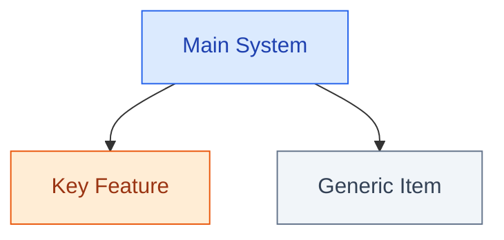

# Mermaid Diagram Standards

When creating or editing mermaid diagrams in blog posts, follow these rules for consistent, readable diagrams in both light and dark themes.

## Semantic CSS Classes

Use `classDef` definitions at the top of each diagram and apply classes with the `:::` syntax. **Never use inline `style` directives** — they don't adapt to dark mode.

### Standard classDef block (copy into each diagram)

```
classDef primary fill:#dbeafe,stroke:#2563eb,color:#1e40af
classDef secondary fill:#dcfce7,stroke:#16a34a,color:#166534
classDef accent fill:#ffedd5,stroke:#ea580c,color:#9a3412
classDef highlight fill:#f3e8ff,stroke:#9333ea,color:#6b21a8
classDef danger fill:#fee2e2,stroke:#dc2626,color:#991b1b
classDef neutral fill:#f1f5f9,stroke:#64748b,color:#334155
```

Only include the classes actually used in that diagram.

### Class semantics

| Class | Color | Use for |
|-------|-------|---------|
| `primary` | Blue | Main subjects, framework elements, clients, hosts |
| `secondary` | Green | Servers, success states, execution, output |
| `accent` | Orange | Highlighted items, configurable elements, key actions |
| `highlight` | Purple | Special layers, transport, distinct categories |
| `danger` | Red | Errors, degradation, warnings, failure states |
| `neutral` | Gray | Generic items, external systems, background elements |

Nodes without a class get the default C4-style blue with white text.

### Applying classes



## Rules

1. **Never use `style NodeId fill:...,stroke:...,color:...`** — these produce inline styles that don't adapt to dark mode and are overridden by the global CSS anyway.
2. **Subgraphs cannot use `classDef`** — leave them unstyled. The global CSS applies appropriate dashed-border cluster styling automatically. Use node colors within subgraphs for visual differentiation.
3. **Use ` ```mermaid` (no space)** to open fenced code blocks. A space before `mermaid` may break rendering.
4. **Supported diagram types for classDef**: `flowchart`, `graph`. Sequence diagrams and state diagrams use theme variables automatically — no manual styling needed.
5. **The `classDef` colors are fallbacks** — they display correctly when viewed outside our site (GitHub preview, RSS). The site's CSS overrides them with proper dark/light mode variants.

## Color palette reference (what CSS applies)

### Light mode
| Class | Fill | Stroke | Text |
|-------|------|--------|------|
| primary | `#dbeafe` | `#2563eb` | `#1e40af` |
| secondary | `#dcfce7` | `#16a34a` | `#166534` |
| accent | `#ffedd5` | `#ea580c` | `#9a3412` |
| highlight | `#f3e8ff` | `#9333ea` | `#6b21a8` |
| danger | `#fee2e2` | `#dc2626` | `#991b1b` |
| neutral | `#f1f5f9` | `#64748b` | `#334155` |

### Dark mode (applied automatically by CSS)
| Class | Fill | Stroke | Text |
|-------|------|--------|------|
| primary | `#1e3a5f` | `#60a5fa` | `#dbeafe` |
| secondary | `#14532d` | `#4ade80` | `#dcfce7` |
| accent | `#7c2d12` | `#fb923c` | `#ffedd5` |
| highlight | `#581c87` | `#c084fc` | `#f3e8ff` |
| danger | `#7f1d1d` | `#f87171` | `#fee2e2` |
| neutral | `#1e293b` | `#94a3b8` | `#e2e8f0` |

CSS source: `hugo-site/assets/css/extended/mermaid.css`
