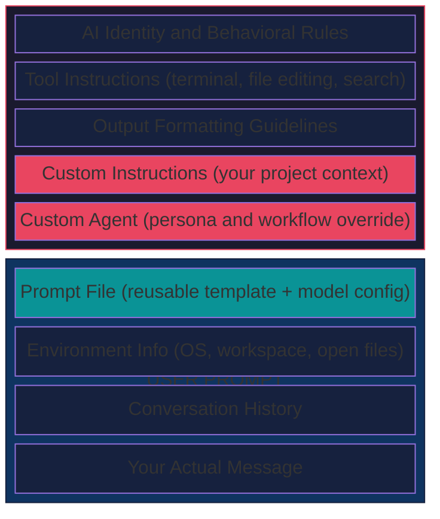
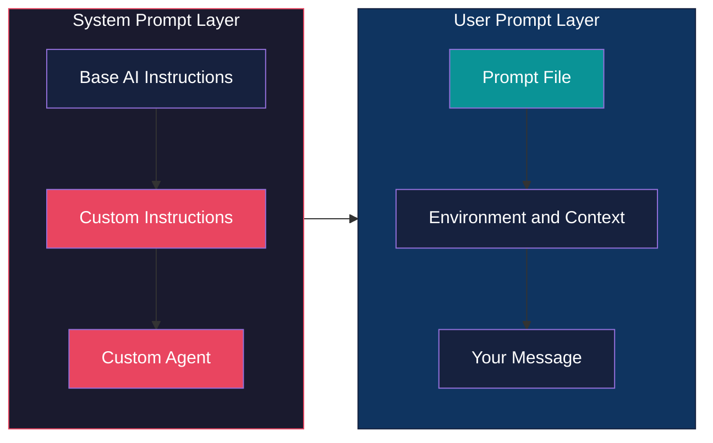
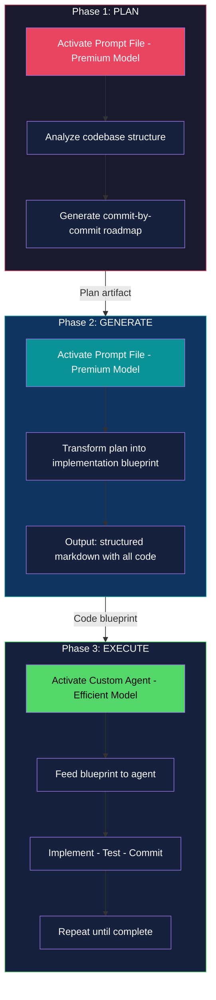

Most developers treat Copilot Chat like a smarter search box. Type a question, get an answer, move on. But the engineers extracting real leverage from it are doing something different—they're thinking architecturally about how VS Code assembles the prompt *before* the model ever sees their message.

Three features sit at the center of this: **Custom Instructions**, **Prompt Files**, and **Custom Agents**. Everyone knows they exist. Almost no one understands *where* each one lands inside the Context Window, or why that placement matters.

That distinction is the difference between wrestling with an AI and conducting one.

## The Context Window Is an Architecture Problem

Before touching the customization tools, you need to see what happens behind the scenes when you press Enter in Copilot Chat. VS Code doesn't just forward your message to the model. It *constructs* a layered prompt—a stack of contexts assembled in a deliberate order.

**The System Prompt** forms the foundation—AI identity, behavioral rules, tool instructions, output formatting. This is the bedrock the model builds every response on, and you don't control most of it.

**The User Prompt** is where your voice enters. But before your actual words, VS Code injects environment metadata (your OS, workspace structure, open files), the conversation history, and any prompt file you've activated.

Your message arrives last—at the bottom of this entire assembled stack.

Here's the critical insight: the more content packed into this window, the less effectively the model focuses on what matters. Research consistently shows that model accuracy degrades in long conversations—a phenomenon called **Context Rot**. Every token in the window is real estate, and most people are filling it with clutter.

## Where Each Tool Lives—And Why It Matters

Knowing *what* these tools do is table stakes. Knowing *where* they're injected in the prompt stack is what gives you leverage.

### Custom Instructions — The Constitution

These provide high-level, persistent context about your project: architecture patterns, coding standards, constraints. Things that should shape *every* response.

**Placement:** End of the **System Prompt**, before any agent override.

Because they live in the system prompt, they establish foundational context before any conversation begins. Multiple instruction files stack together—your project-specific rules loading alongside Copilot's own guidelines. Think of them as the *constitution* of your AI-assisted workspace. They don't execute anything; they constrain everything.

**Best for:** Project architecture definitions, preferred patterns, coding standards that apply universally.

### Prompt Files — The Playbook

Reusable prompt templates stored in your project. The underappreciated detail: you can configure them with front matter to specify *which model* to use.

**Placement:** Top of the **User Prompt**, before environment context and your actual message.

This is what makes them powerful. A prompt file can switch models dynamically—route a planning task to Claude Opus, a refactoring job to GPT-4o. Your team can share them like any other project artifact. They're version-controlled, reviewable, repeatable.

**Best for:** Repeatable tasks, model-switching workflows, standardized prompts your team shares.

### Custom Agents — The Role

Previously called "Custom Modes," these override the default agent behavior to impose a specific persona or workflow. A "Plan Mode" agent. A "Review Mode" agent. A "Ship It" agent.

**Placement:** The **very end** of the System Prompt—after Custom Instructions. They get the final word before processing begins.

If Custom Instructions are the rules, the Custom Agent is the *role* that enforces them. Agents define identity, workflows, and available tools. They can restrict the agent from writing files (plan-only mode) or force it to always run tests before committing.

**Best for:** Specialized workflow phases—planning, code review, implementation, documentation.

## An Agentic Workflow That Actually Works

Here's where theory becomes leverage. The key insight: different phases of development require different levels of AI capability. Planning demands reasoning depth. Implementation demands speed and consistency. Treating them identically is waste.

**Phase 1 — Plan (Premium Model).** Use a Prompt File configured to activate a powerful model like Claude Opus. Have it analyze your codebase and generate a structured plan—small, testable steps, essentially a commit-by-commit roadmap. This is where reasoning depth matters, and you want the best model you can afford.

**Phase 2 — Generate (Premium Model).** Use another Prompt File to take that plan and produce a comprehensive markdown document containing all the code for each step. You're not asking it to edit files directly. You're asking it to produce the complete implementation blueprint while the reasoning model is still engaged.

**Phase 3 — Execute (Efficient Model).** Clear your context window—start fresh. Activate a Custom Agent configured with a faster, cost-effective model like GPT-4o-mini. Feed it the markdown blueprint. The agent's job is mechanical: implement the code step-by-step as written, run tests, report results.

Implement. Test. Commit. Next step.

This approach concentrates premium model spend on the phases where reasoning matters—planning and code generation—while using efficient models for the mechanical work. You get the analytical power where it counts, and you get it at a fraction of the cost of running a premium model end-to-end.

## Principles for Disciplined AI-Assisted Development

These aren't tips. They're constraints that separate productive AI workflows from expensive ones.

1. **Know your tool before you reach for it.** Are you setting project context (Custom Instructions), executing a templated task (Prompt File), or changing the agent's operating mode (Custom Agent)? If you can't answer that before opening Chat, you're prompting by accident.

2. **Treat every token as real estate.** Context Rot is real. Avoid redundant information, start fresh sessions when conversations grow long, and design your instruction files to be concise. The best instruction file is the shortest one that still constrains the model correctly.

3. **Match model to task.** Premium models for analysis and planning. Efficient models for implementation and iteration. Running Claude Opus to rename a variable is like hiring an architect to move a chair.

4. **Iterate in small, testable steps.** Verify each output before moving forward. The moment you skip verification, you're compounding risk across every subsequent step.

5. **Maintain your configuration.** Instruction files, prompt files, and agents are living artifacts. Review them regularly. Delete what's no longer relevant. Keep them aligned with your evolving project, not the project you had three months ago.

6. **Stand on the shoulders of the community.** The [Awesome Copilot](https://github.com/github/awesome-copilot) repository is a growing collection of community-contributed prompt files, instructions, and agents. Start there before building from scratch.

---

The developers getting disproportionate value from Copilot aren't the ones typing better prompts. They're the ones who understand the architecture underneath—and design their workflows to exploit it.

Stop treating Copilot Chat like a search bar. Start treating it like a system you architect.
