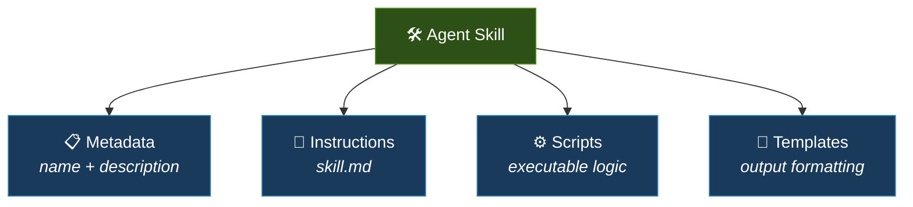
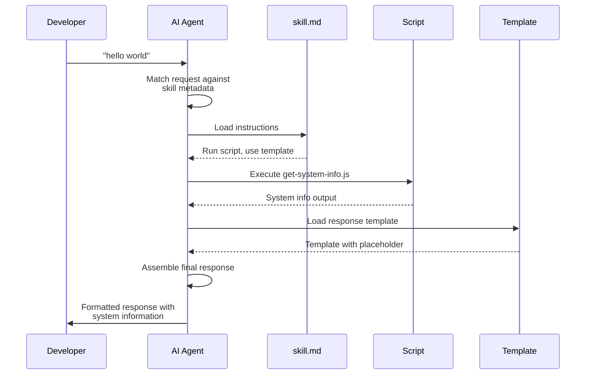
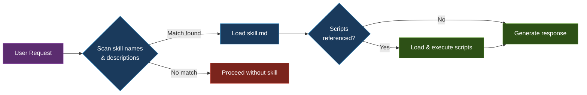
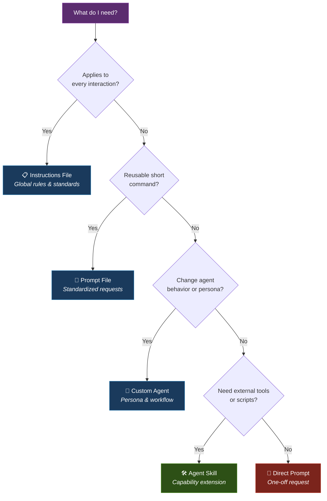

Agent Skills have arrived for Visual Studio and VS Code — and for once, the hype is warranted.

If you've been in this industry long enough, every new feature announcement triggers the same reflex: *another abstraction to learn, another tool to evaluate, another update to your mental model.* The pace is relentless, and most of it doesn't stick.

But Agent Skills are different. They solve a real problem — how to give an AI assistant **capabilities it doesn't natively have** — in a way that's simple, modular, and context-efficient. They're worth understanding, and they're worth building.

Let's walk through what they are, build one from scratch, and establish a clear framework for when to use them versus other AI customization options.

## What Are Agent Skills?

Agent Skills originated as a specification from Anthropic and have since been adopted across tools including Claude Code, GitHub Copilot, and other AI-powered development environments. As of this writing, they remain experimental — but the underlying concept is sound and likely to persist in some form.

At their core, a Skill is a **structured instruction package**. Unlike flat instruction files that apply globally, Skills bundle together metadata, behavioral instructions, executable scripts, and output templates into a self-contained unit.



This composability is what sets Skills apart. Standard custom instructions tell the agent *how to behave*. Skills tell it *how to do things it couldn't do before*.

### Setting Up the Directory Structure

The setup is straightforward. At the root of your project:

1. Create a `.github` directory (if it doesn't already exist).
2. Inside it, create a `skills` directory.
3. Inside that, create a directory for each skill you want to define.

```text
project-root/
└── .github/
    └── skills/
        ├── hello-world/
        │   ├── skill.md
        │   ├── scripts/
        │   └── templates/
        └── pdf-reader/
            ├── skill.md
            └── scripts/
```

Each skill is isolated, portable, and version-controlled alongside your codebase.

## Building Your First Skill: A Walkthrough

Let's build a simple skill that responds to "hello world" with system information and formatted output — enough to illustrate every moving part.

### 1. Define the Metadata

Create `skill.md` inside your skill directory. The frontmatter gives the agent a quick summary for matching purposes:

```yaml
---
name: hello-world
description: Responds with ASCII art and system information when the user enters "hello world".
---
```

This metadata is critical. As we'll see shortly, it's the first — and sometimes only — thing the agent reads about your skill.

### 2. Write the Instructions

Below the frontmatter, define the behavioral contract:

```markdown
# Hello World Skill

When the user enters the phrase "hello world":
1. Run the script located at `scripts/get-system-info.js`.
2. Respond with the text from `templates/response.md`.
3. Include the system information obtained from the script in the response.
```

Clear, imperative instructions. No ambiguity about what the agent should do.

### 3. Add the Executable Logic

Create `scripts/get-system-info.js`:

```javascript
const os = require('os');

console.log(`Platform: ${os.platform()}`);
console.log(`Type: ${os.type()}`);
console.log(`Release: ${os.release()}`);
console.log(`Architecture: ${os.arch()}`);
```

And `templates/response.md`:

```markdown
Hello! You've triggered the hello world skill.

Here is your system information:
{{SYSTEM_INFO}}
```

When invoked, the agent executes the script, captures the output, injects it into the template, and returns the assembled response. Each step is modular — swap the script or the template independently without touching the rest.



## Progressive Loading: Why This Architecture Matters

Skills are designed with **context window economy** in mind. The agent doesn't load every skill into memory at startup. Instead, it follows a tiered resolution process:



This progressive loading means your context window is reserved for the problem at hand — not consumed by skill definitions the agent doesn't need. It's a practical application of lazy evaluation, and it's one of the strongest architectural decisions in the specification.

This is also why the **metadata matters**. A vague or poorly written description means the agent might never match your skill to the right request. Write descriptions as if you're writing function signatures — precise, unambiguous, and searchable.

## A Practical Example: Teaching the Agent to Read PDFs

Large language models, despite their sophistication, still struggle with certain file formats. PDFs are a classic example — dense layouts, embedded tables, and mixed content types make reliable extraction difficult.

Agent Skills solve this elegantly. Community-maintained skill repositories (such as those on GitHub for Copilot and Claude) include pre-built PDF reading skills. Drop the skill folder into your `.github/skills` directory, and the agent can now invoke Python-based extraction libraries to parse PDF content reliably.

The model didn't become smarter. You gave it the right tool for the job.

## Choosing the Right AI Customization Tool

Not every problem calls for an Agent Skill. The AI customization landscape in modern editors now includes several distinct mechanisms, each suited to different scenarios.



Here's the decision framework:

| Tool | Use When | Example |
|------|----------|---------|
| **Instructions File** | Context applies to every interaction | "All code must follow the company style guide." |
| **Prompt File** | You reuse a short, specific command frequently | "Refactor this function for readability." |
| **Custom Agent** | You need to change how the agent thinks or behaves | "Act as a security auditor and review for vulnerabilities." |
| **Agent Skill** | You need to bundle scripts, templates, or external tools | "Extract tables from this PDF and format as markdown." |

The key insight: **Instructions and Prompts shape behavior. Custom Agents shape identity. Skills shape capability.**

## Key Takeaways

Agent Skills are not magic — they're modular tooling. They represent a principled way to extend what an AI assistant can do, without overloading its context or relying on prompt engineering alone.

Three things to remember:

1. **Skills extend capability.** They let you hand the agent tools it doesn't have natively — scripts, templates, external processes.
2. **Progressive loading is the architecture.** Write precise metadata so the agent can match skills efficiently without wasting context.
3. **Choose the right tool for the job.** Not everything needs a Skill. Use the decision framework above to match the mechanism to the problem.

Agent Skills are currently experimental, but the pattern they establish — declarative, modular, version-controlled AI customization — is here to stay. If you're building with Copilot or Claude Code, it's worth investing the time to define skills for your most common workflows.

The feature toggle is in your editor settings. Build your first skill, iterate on it, and make the agent work the way *you* need it to.
