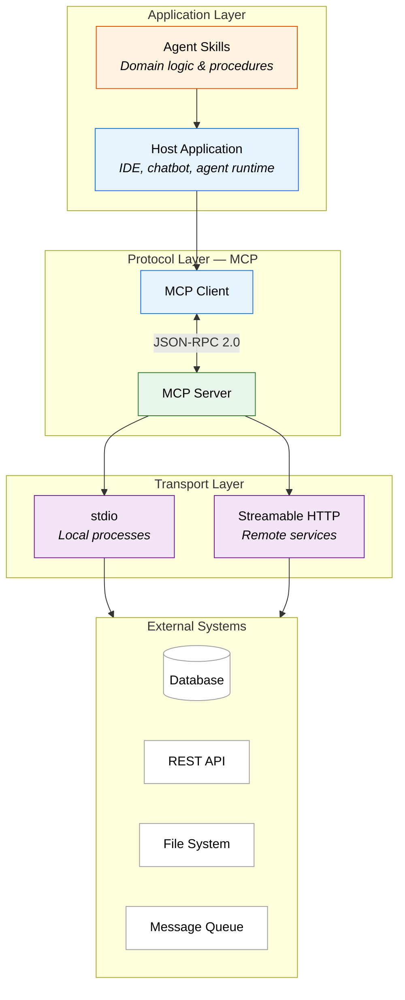
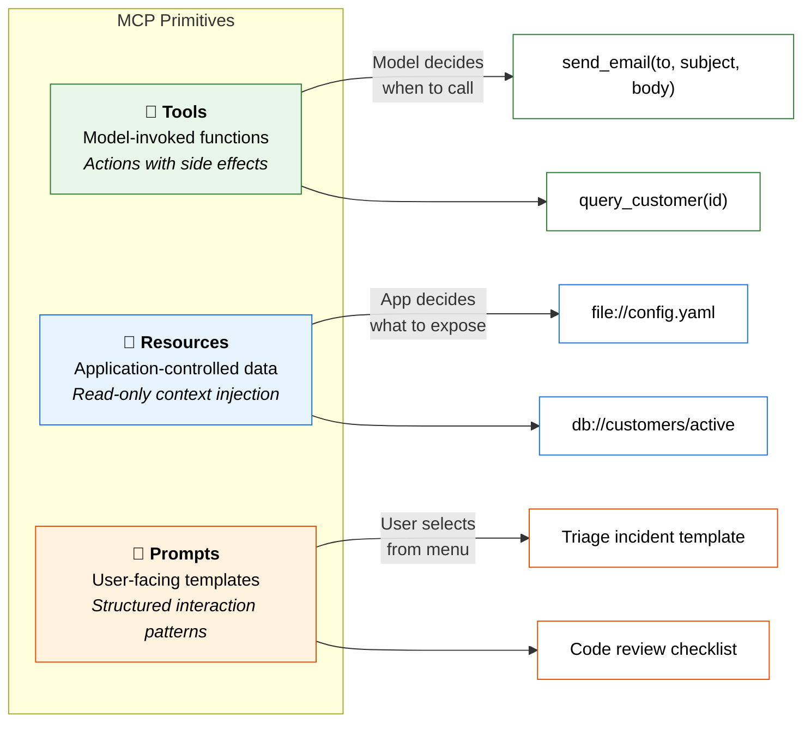
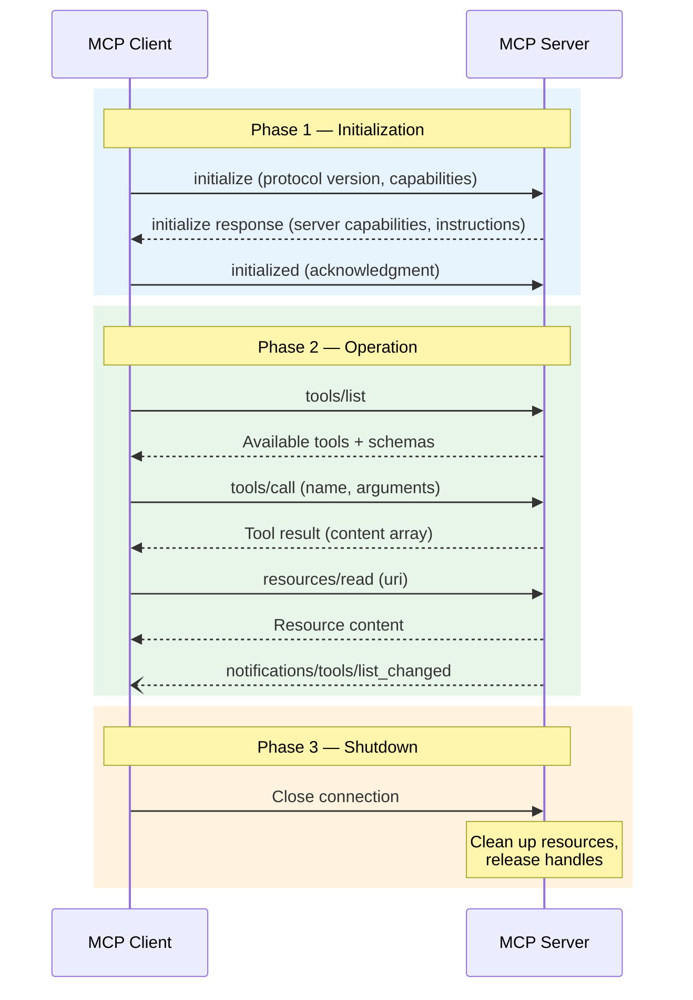
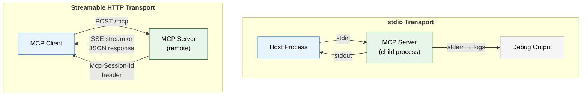
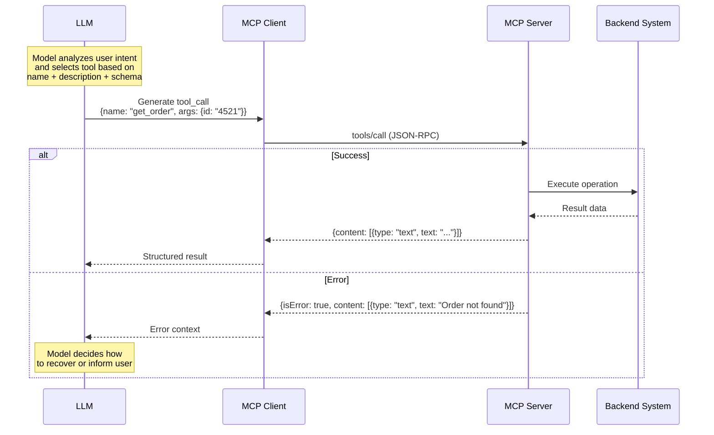
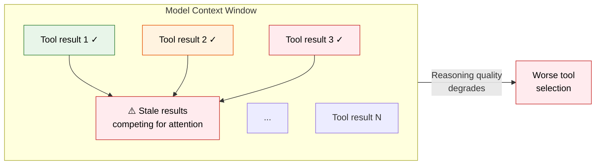

Every new protocol arrives with a metaphor. REST was "resources on the web." GraphQL was "ask for exactly what you need." The **Model Context Protocol (MCP)** is being branded as "the USB standard for AI"—a universal interface that lets any model plug into any system.

It is a useful metaphor. It is also incomplete. USB took decades of iteration, competing standards, and a graveyard of incompatible peripherals before it became universal. MCP is at the beginning of that journey, and if you are building on it today, you need to understand what is happening beneath the abstraction.

<!--more-->

This post is the protocol-level deep dive. Not the what-it-means-for-your-architecture view—I cover that in the [follow-up on MCP + Agent Skills](/blog/mcp-heads-with-agent-skills). This is about the wire format, the lifecycle, the transport options, and the places where things break.

## The Protocol Stack

MCP is built on **JSON-RPC 2.0**. Every message—whether it is a tool invocation, a capability advertisement, or a session initialization—is a JSON-RPC frame. If you have worked with Language Server Protocol (LSP) in VS Code, the structure will feel familiar. That is not a coincidence; MCP draws directly from the same lineage.



The layering matters. The **transport** handles bytes on the wire. The **protocol** handles message framing, routing, and lifecycle. The **application** layer is where your domain logic lives. Conflating these layers—which most tutorials do—leads to designs that are fragile in production.

## The Three Primitives

MCP exposes three types of capabilities, each serving a distinct role in how a model interacts with external systems:



**Tools** are the most powerful—and the most dangerous. The model decides when to invoke them, and they can have side effects (writing data, sending messages, triggering workflows). The server exposes a tool with a name, a description, and a JSON Schema for its inputs. The model reads that schema and generates a structured call.

**Resources** are the opposite: they are controlled by the application, not the model. Think of them as context the host injects into the conversation—a configuration file, a set of recent logs, a customer record. The model can read them but cannot request arbitrary resources on its own.

**Prompts** are predefined interaction templates. They bridge the gap between a user's intent and the structured inputs the model needs. A "triage production incident" prompt, for example, might collect severity, affected service, and timeline before the model begins analysis.

The distinction between these three is not cosmetic. It defines **who is in control at each step**—and getting that control model wrong is where most MCP implementations fail.

## The Lifecycle: Initialize, Operate, Shutdown

Every MCP session follows a strict lifecycle. The protocol is **stateful**—it maintains context across a session, which is fundamentally different from stateless REST calls.



The initialization handshake is where **capability negotiation** happens. The client declares what it supports (tool calling, resource subscriptions, prompt rendering). The server responds with what it offers. If the client does not declare support for a capability, the server will not expose it—even if the server has it available.

This is where things get subtle. A model connected through a client that does not support resource subscriptions will never receive live updates, even if the server is broadcasting them. The **client's declared capabilities constrain the session**, not just the server's offerings.

### What the Handshake Looks Like on the Wire

```json
// Client → Server
{
  "jsonrpc": "2.0",
  "id": 1,
  "method": "initialize",
  "params": {
    "protocolVersion": "2025-03-26",
    "capabilities": {
      "roots": { "listChanged": true }
    },
    "clientInfo": {
      "name": "my-ai-host",
      "version": "1.0.0"
    }
  }
}

// Server → Client
{
  "jsonrpc": "2.0",
  "id": 1,
  "result": {
    "protocolVersion": "2025-03-26",
    "capabilities": {
      "tools": { "listChanged": true },
      "resources": { "subscribe": true },
      "prompts": { "listChanged": true }
    },
    "serverInfo": {
      "name": "enterprise-tools",
      "version": "2.1.0"
    }
  }
}
```

Note the `protocolVersion` field. If client and server disagree on the version, the connection fails. There is no graceful degradation. This is a deliberate design choice—it prevents silent incompatibility—but it also means that version management across your MCP infrastructure is not optional.

## Transport: How Bytes Move

MCP defines two transport mechanisms, and choosing the wrong one will cost you.



### stdio: Simple, Local, Fast

The client spawns the MCP server as a child process. Messages flow through `stdin` and `stdout`. No network. No TLS. No port management. The server logs to `stderr` so it does not corrupt the protocol stream.

**Use stdio when:** the server runs on the same machine as the host (IDE plugins, local CLI tools, development workflows). It is the fastest option and the easiest to debug—you can literally pipe the output to a file and read the raw JSON-RPC frames.

**Do not use stdio when:** you need remote access, horizontal scaling, or shared state across clients.

### Streamable HTTP: Remote, Stateful, Complex

The client sends HTTP POST requests to a single endpoint (e.g., `/mcp`). The server can respond with a plain JSON body for simple request-response patterns, or open a **Server-Sent Events (SSE)** stream for long-running operations and server-initiated notifications.

Session state is tracked via the `Mcp-Session-Id` header. This is where enterprise deployments run into trouble:

- **Reverse proxies** that strip non-standard headers will silently kill session continuity
- **Load balancers** with round-robin routing will scatter session requests across servers with no shared state
- **Aggressive TTLs** will expire sessions mid-workflow, forcing the model to start over

If you are deploying MCP behind a corporate gateway, audit your HTTP path end-to-end before writing a single line of application code.

## Tool Invocation: The Critical Path

When the model decides to call a tool, this is what happens at the protocol level:



Three things to notice:

1. **The model selects the tool based on metadata alone.** It reads the tool name, description, and input schema—then generates a structured call. If your description is ambiguous, the model will pick the wrong tool. This is not a bug; it is a design consequence. Your tool descriptions are effectively **instructions to an autonomous agent**.

2. **Errors are content, not exceptions.** MCP returns errors as `isError: true` with a textual explanation in the content array. The model then decides how to recover—retry, try a different tool, or ask the user for clarification. This is a meaningful design choice: it keeps the model in the decision loop rather than crashing the interaction.

3. **The result is always a content array.** Not a raw JSON blob. Not a string. An array of typed content items (`text`, `image`, `resource`). This standardization means the client can render results consistently regardless of which tool produced them.

## Where the Protocol Breaks

I have been working with MCP implementations long enough to see the patterns of failure. Here are the ones that are not in the documentation.

### Context Rot

Every tool result gets injected back into the model's context window. In a multi-step workflow—five, ten, twenty tool calls—the context fills with stale intermediate results. The model starts weighting old results alongside new ones, and its reasoning degrades.



**The fix:** Design tools that return concise, structured results. Avoid dumping raw database responses or full API payloads into the context. Summarize. Filter. Return only what the model needs for the next decision.

### Tool Proliferation

It is tempting to expose every API endpoint as an MCP tool. Do not. Models become measurably worse at tool selection as the number of available tools increases. Research from multiple groups shows degradation starting around 15–20 tools in a single session.

| Tool Count | Selection Accuracy | Failure Mode |
|------------|-------------------|--------------|
| 1–10 | High | Rare misselection |
| 10–20 | Moderate | Occasional wrong tool |
| 20+ | Degraded | Frequent hallucinated tool names |

**The fix:** Organize tools into **scoped tool packs**. A "customer support" session gets customer tools. A "deployment" session gets infrastructure tools. Never expose everything at once.

### The Security Surface You Forgot

MCP, as a protocol, has **no built-in authentication or authorization layer**. It relies entirely on the transport layer for security—TLS for HTTP, process isolation for stdio.

This means:
- There is no standard way to restrict which tools a specific user can invoke
- There is no built-in audit trail for tool calls
- OAuth 2.1 integration exists for HTTP transport, but the implementation burden is on you

If you are exposing MCP tools that can write data, send messages, or modify state—and you are doing this in a multi-tenant environment—you need to build your own authorization layer. The protocol will not save you.

---

## What This Means in Practice

MCP is real infrastructure, not vaporware. The protocol design is thoughtful: the strict lifecycle prevents silent incompatibility, the capability negotiation ensures client and server agree on what is possible, and the transport abstraction lets you choose the right deployment model for your context.

But it is also young. The security story is incomplete. The tooling is immature. The failure modes in enterprise environments—proxy interference, context rot, tool sprawl—are real and will bite you if you do not design for them.

Here is my checklist for anyone building on MCP today:

1. **Start with stdio transport** for local development. Get the protocol semantics right before adding network complexity
2. **Write tool descriptions like API contracts**, not README summaries. The model's ability to use your tool is directly proportional to the quality of your metadata
3. **Cap your tool count per session.** Ten focused tools outperform fifty unfocused ones
4. **Audit your HTTP path** for header stripping and session affinity before deploying Streamable HTTP
5. **Design for context hygiene.** Tools that return minimal, structured results will outperform tools that dump raw payloads

The protocol layer is the foundation. Get it right, and everything you build on top—Skills, agents, autonomous workflows—has a stable base. Get it wrong, and you will spend your time debugging transport issues instead of building capabilities.

**Next:** [MCP and Agent Skills: The Protocol Layer That Makes AI Actually Useful](/blog/mcp-heads-with-agent-skills) — where I cover how MCP and Agent Skills complement each other at the architecture level.
