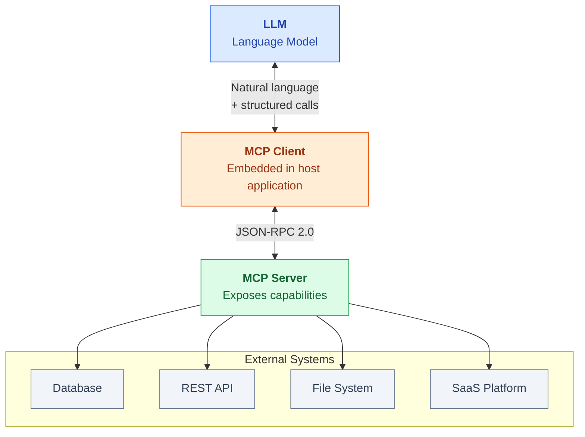
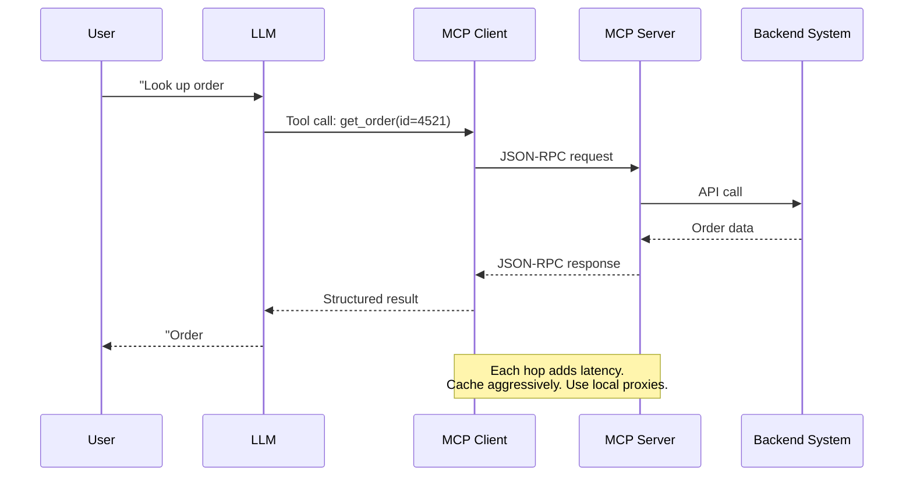
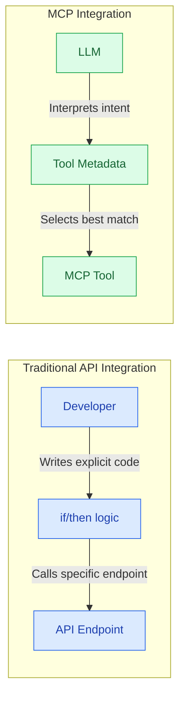
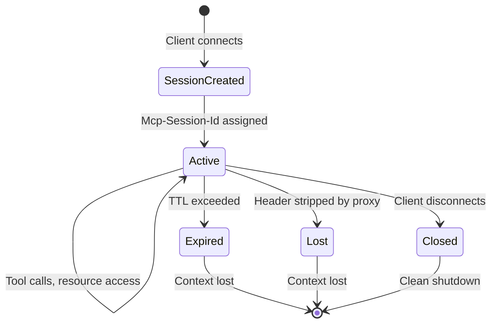
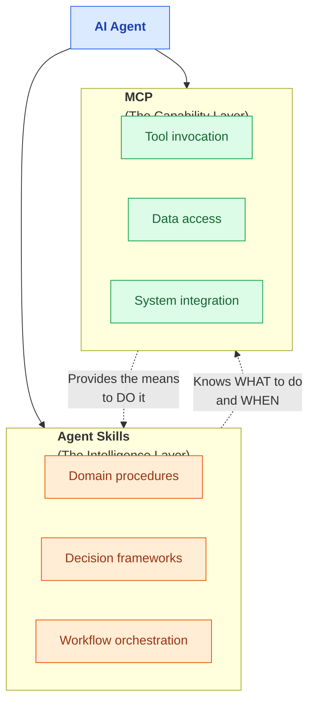

The way software integrates with AI is shifting. Hard-coded API connectors and rigid endpoint mappings served us well for decades, but they were designed for a world where the **developer** decided what to call and when. That world is changing.

The **Model Context Protocol (MCP)** is an open standard that defines how large language models communicate with external systems. If you are building anything that connects an LLM to real data or real actions, MCP is the protocol layer you need to understand.

<!--more-->

I have spent time working through MCP implementations and thinking about where it fits in the broader architecture of agentic systems. This post captures what I have learned—what MCP actually is, where it breaks down, and why it only works when paired with Agent Skills.

## What MCP Actually Is

MCP sits between the model (the "brain") and your systems (the "world"). It provides a standardized interface so the model can discover, understand, and invoke external capabilities without bespoke integration code for every service.

The protocol relies on three primitives:

- **Tools** — Functions the model can invoke (e.g., "send email," "query customer by ID")
- **Resources** — Data objects injected into context (files, database records, configuration)
- **Prompts** — Templates that guide model behavior and reduce hallucination

Under the hood, it uses **JSON-RPC 2.0** and follows a client-server architecture. Think of it as a USB standard for AI: a single interface that any compliant system can plug into.

## Why the Old Way Does Not Scale

Before MCP, every AI integration was a one-off connector. Each new data source required its own SDK, its own authentication flow, its own error handling, and its own documentation. The result was fragmented, brittle, and expensive to maintain.

MCP addresses this by standardizing **discovery** and **invocation**. The model learns what tools are available, what each tool does, and what parameters it expects—all through the protocol itself. You build the connector once, and any MCP-compatible client can use it.

This is not a marginal improvement. It is the difference between building a custom cable for every device and adopting a universal standard.

## Where MCP Gets Difficult

A standard solves the interface problem. It does not solve the operational problems that come with giving a probabilistic model access to real systems.

### Security: Scoping Access Correctly

When you expose tools through MCP, you are granting an LLM the ability to take actions in your environment. The risk is not theoretical.

- **Over-privileged tools** — A broadly scoped tool like `execute_sql` with no guardrails will do exactly what the model asks, including destructive operations the user never intended
- **The mitigation** — Design **least-privilege tool packs**. Each tool should have a narrow, well-defined scope. Prefer `get_customer_by_id` over `run_any_query`. Apply the same access control discipline you would for any service account

### Ambiguity: Metadata Quality Matters

Models select tools based on their descriptions and schemas. Vague metadata leads to wrong tool selection, which leads to incorrect actions.

| Quality | Tool Description | Outcome |
|---------|-----------------|---------|
| **Weak** | "Interacts with the database" | Model guesses which operation to perform |
| **Strong** | "Fetches a single customer record by ID. Returns 404 if not found. Do not use for list queries." | Model invokes correctly with high reliability |

The fix is straightforward: write precise **JSON Schema** definitions. If you cannot define the tool's behavior in a schema, the model cannot use it reliably.

### Latency: Every Hop Costs Time

MCP adds network hops to every interaction. The call chain—LLM to client to server to backend—introduces latency at each step.

For interactive use cases, this matters. Aggressive caching, local MCP server proxies, and connection pooling are not optimizations—they are requirements.

## MCP vs. Traditional APIs: A Shift in Control

MCP is not just another API abstraction. It represents a fundamental change in **who decides what to call**.

In a traditional integration, the **developer** decides which endpoint to call. The logic is explicit and deterministic. In MCP, the **model** interprets the user's intent, reads tool metadata, and selects the best match. The logic is probabilistic.

This makes MCP far more sensitive to design quality. When a human developer encounters poor API documentation, they can often reason through it. When an LLM encounters poor tool metadata, it hallucinates a solution—and that hallucination may execute against your production systems.

**The takeaway:** In MCP, your tool descriptions are not documentation. They are **instructions to an autonomous agent**. Write them accordingly.

## Session Management: Stateful Workflows Over Stateless Protocols

HTTP is stateless. Your workflows are not.

MCP bridges this gap with **Session IDs**. The client and server share a unique identifier (`Mcp-Session-Id`) that maintains conversation state across requests—tools invoked, resources shared, intermediate results accumulated.

Two failure modes come up repeatedly in enterprise deployments:

- **Header stripping** — Corporate reverse proxies or API gateways that strip custom headers will silently destroy session continuity. Every request appears as a new session, and the agent loses all accumulated context
- **Aggressive TTLs** — Sessions that expire too quickly turn multi-step workflows into a series of disconnected interactions. Set TTLs based on actual workflow duration, not arbitrary defaults

## Skills and MCP: Complementary, Not Competing

I often see **Agent Skills** and **MCP** discussed as though they are interchangeable. They are not. They solve different problems, and you need both.

- **Skills** teach the agent **how to think about a domain**. They encode procedures, decision logic, and workflow knowledge. "How to triage a production incident." "How to validate a customer onboarding form." "When to escalate versus resolve."
- **MCP** gives the agent **the ability to act**. It provides access to databases, APIs, messaging systems, and file stores. "Read the incident log." "Post to the on-call channel." "Update the ticket status."

**Skills provide judgment. MCP provides reach.**

An agent with MCP but no Skills has tools but no strategy—it can interact with your systems but lacks the domain knowledge to make good decisions. An agent with Skills but no MCP has strategy but no tools—it understands the domain but cannot act on that understanding.

The real work is in designing how these layers interact. That is an architectural decision, not a configuration step.

## Practical Takeaways

If you are adopting MCP in your organization, here is what I would focus on:

1. **Treat tool descriptions as contracts.** They are the primary interface between the model and your systems. Invest as much rigor in them as you would in an API specification
2. **Scope tools narrowly.** Least privilege is not optional. Every tool should do one thing, with clear boundaries on what it can and cannot access
3. **Design for session continuity.** Audit your network path for anything that strips headers. Set TTLs that reflect real workflow durations
4. **Pair MCP with Skills from the start.** Tools without domain logic produce unpredictable behavior. Define the procedural knowledge your agent needs before exposing capabilities
5. **Monitor tool invocations in production.** Log which tools the model selects, how often, and whether the selections are correct. This is your feedback loop for improving metadata quality

MCP is not magic. It is infrastructure. And like all infrastructure, it delivers value quietly when designed well—and creates expensive problems when it is not.

The shift toward standardized, context-aware AI integration is real. The question is whether you build on a solid protocol layer or continue maintaining a growing collection of bespoke connectors. I know which approach scales.
