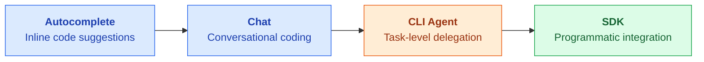
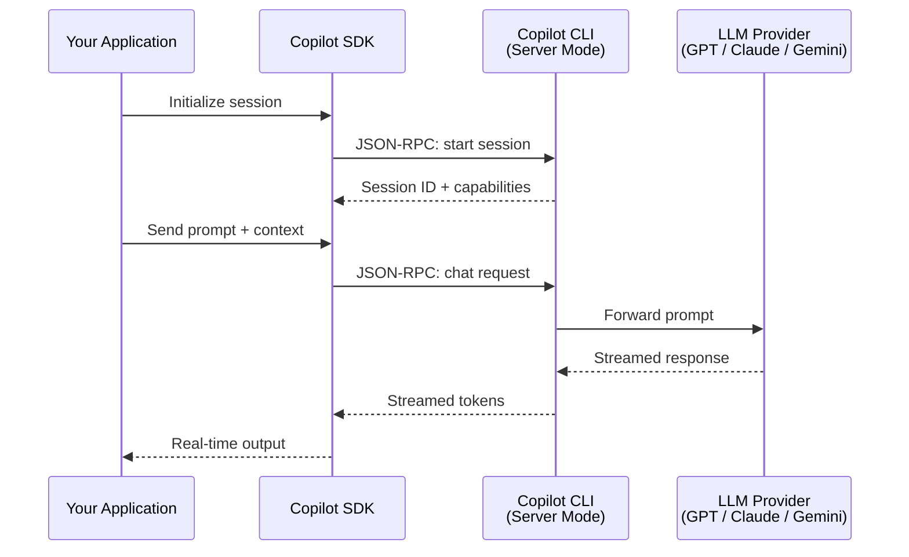
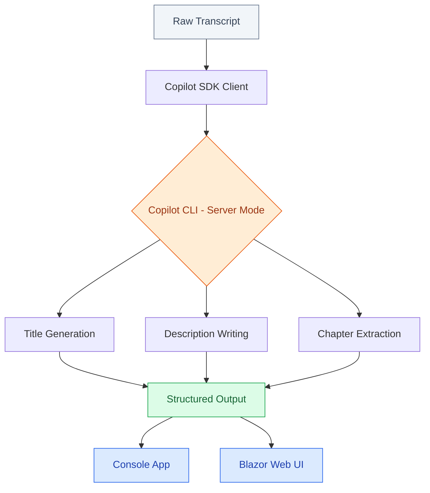
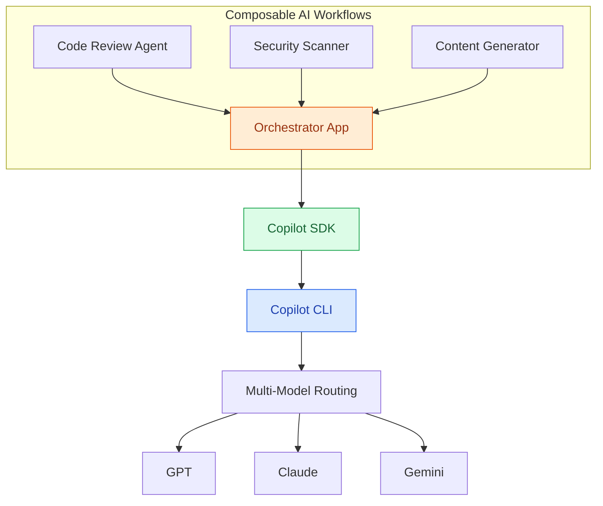

Most developers still interact with GitHub Copilot the same way they did two years ago: as a code suggestion engine inside their IDE. That was a reasonable starting point. It is no longer the full picture.

Copilot has quietly evolved into something more substantial. I use it in VS Code, Visual Studio, and on my phone—assigning issues to a coding agent from the GitHub mobile app. The CLI now supports planning mode, cloud delegation, custom agents, and sub-agents. These are not incremental improvements. They represent a shift from *assisted development* to *delegated development*.

But if the CLI is where the real power lives, the SDK is how you harness it programmatically. That distinction matters.

## From Assisted to Delegated Development

The progression is worth understanding clearly, because it changes how you think about building software.

At each stage, the scope of what the developer delegates expands. Autocomplete handles expressions. Chat handles explanations. The CLI handles tasks. The SDK lets you build systems that orchestrate those tasks without human intervention at each step.

## The SDK: Architecture and Capabilities

For a long time, integrating AI into applications meant standing up heavy infrastructure—managed endpoints, token billing, API key rotation. That works at scale, but it is a high barrier for teams that want to move quickly.

The **Copilot SDK** takes a different approach. Currently in technical preview, it provides language bindings for **Node.js**, **Python**, **Go**, and **C#** that communicate with the Copilot CLI via JSON-RPC. Your application acts as the client. The CLI runs in server mode on your local machine.

This architecture gives you several things that are hard to get otherwise:

- **Session management** — Maintain conversation context across multiple requests without rebuilding state.
- **Multi-model access** — Switch between GPT, Claude, and Gemini within the same session. The CLI handles provider routing.
- **Tool calling** — Let the model invoke tools (file operations, terminal commands, search) as part of its reasoning chain.
- **Streaming** — Receive tokens as they are generated, enabling responsive UIs and real-time processing.
- **No separate API keys** — Authentication flows through your existing GitHub subscription.

The critical insight is that there is no separate billing surface. You are using the same Copilot entitlements you already pay for, accessed through a local runtime rather than a cloud API.

## Practical Example: Podcast Metadata Generator

Theory only matters if it translates into working software. Here is a concrete application I built using the SDK.

The problem: I produce content regularly—podcasts and video. Each episode requires a title, description, and time-stamped YouTube chapters. Doing this manually takes 20–30 minutes per episode. Doing it with generic LLM prompts yields inconsistent results because the model lacks structure.

The solution: a **Podcast Metadata Generator** that uses the Copilot SDK to produce structured output from raw transcripts.

I built both a console app and a Blazor web application in under an hour. The implementation was straightforward:

1. **Install** the `github.copilot.sdk` NuGet package.
2. **Initialize** a session with a specific model.
3. **Verify** the connection with a health check ping.
4. **Stream** results back as the model processes the transcript.

The app sends a long transcript with structured instructions, and the model returns titles, descriptions, and time-stamped chapters in real-time. No API keys to manage. No token-level billing to monitor. The existing GitHub subscription handles authentication and access.

The result: what used to take 20–30 minutes of manual work per episode now runs in under two minutes with consistent formatting. That is the kind of leverage that compounds—not just for one task, but for any repeatable content workflow.

## Where This Leads

The SDK is in technical preview, which means the API surface may change. But the architectural direction is clear. Consider what becomes possible when you combine the SDK with other Copilot capabilities:

- **Automated code review pipelines** that check for security vulnerabilities, style violations, and architectural anti-patterns—triggered on every pull request.
- **Content workflows** that generate documentation, release notes, or marketing copy from structured inputs.
- **Custom development agents** that understand your codebase conventions and enforce them during generation.

The common thread is delegation with structure. You define the workflow. The agent executes it. The SDK is the interface between your intent and the machine's execution.

## The Shift in Mindset

This is not about replacing developers. It is about changing what developers spend their time on.

The distinction between a developer who types code and one who architects systems has always existed. What the Copilot SDK does is widen that gap. If your daily work consists of tasks that can be described in a structured prompt, those tasks are candidates for delegation. What remains—system design, trade-off analysis, user empathy, judgment calls—is the work that justifies your seat at the table.

The tools have arrived. The SDK is available. The CLI is updating rapidly. The question is not whether this shift will happen. It is whether you will be the one designing the workflows or the one being replaced by them.

Get the SDK. Update your CLI. Start building.
