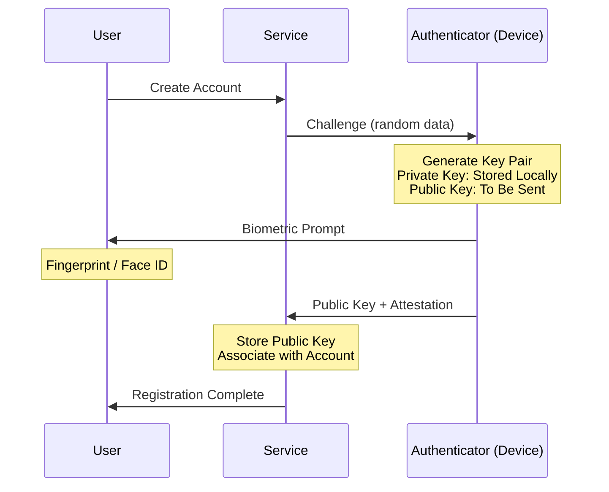
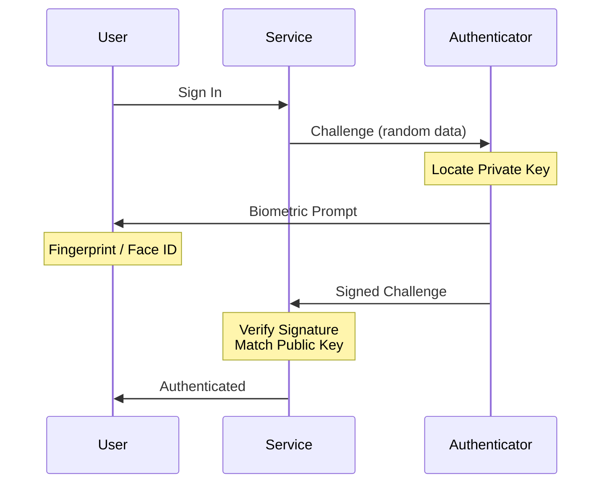

Passwords ask us to do something fundamentally unreasonable.

Create something complex. Make it unique across 100+ accounts. Never write it down. Remember it perfectly. Change it regularly.

When security is too difficult, humans find workarounds. "Password123!" becomes "Password123!!" becomes "Password1234!". Support tickets pile up. Breaches keep happening. We've spent decades adding layers — complexity requirements, two-factor authentication, forced resets — but we've been reinforcing a broken foundation.

Passkeys replace that foundation entirely.

---

## What Passkeys Actually Are

A passkey uses public-key cryptography — the same math that secures TLS connections and digital signatures — to authenticate you without ever transmitting a shared secret.

When you register with a service, your device generates a key pair:

- A **public key** stays with the service (think of it as a lock)
- A **private key** never leaves your device (this is your key)

When you log in, the service sends a cryptographic challenge. Your device signs it with the private key. The service verifies the signature against the stored public key. Done.

**No password is created, transmitted, or stored.** There is nothing to phish, nothing to leak in a breach, nothing to forget.

Total login time: about two seconds. A fingerprint tap or Face ID glance, and you're in.

---

## Why This Matters for Security

### Phishing becomes structurally impossible

Passkeys are bound to the origin domain. Even if a user lands on a convincing fake site, the authenticator won't respond — the domain doesn't match. There's no credential to surrender, no link to click that compromises anything.

This isn't a policy improvement. It's an architectural one.

### Data breaches lose their payload

When attackers steal a password database, they get reusable credentials — often across multiple services. With passkeys, they get public keys. Public keys are, by design, *supposed* to be public. Without the corresponding private key (which never left the user's device), they're cryptographically useless.

### Security and usability stop being opposites

We've been conditioned to believe that more security means more friction. Passkeys break that trade-off:

- Nothing to remember
- Nothing to type  
- Faster than passwords
- Works across devices
- Resistant to the full spectrum of credential attacks

It's the rare case where the more secure option is also the easier one. Security that works *with* human nature instead of against it.

---

## The Technical Flow

For those who want to understand the machinery:

### Registration

### Authentication

**Key properties:**

- The private key never leaves the device
- Each challenge is unique — replay attacks don't work
- The service only stores public keys — breach impact is minimal
- User verification (biometric or PIN) happens locally on the device

---

## Device Portability

The practical concern: what happens when you get a new device?

**Cloud sync.** iCloud Keychain and Google Password Manager sync passkeys across devices transparently. Upgrade your phone, and your passkeys follow — protected by your platform account's own security.

**Hardware security keys.** For higher-assurance environments, YubiKeys and similar devices store passkeys on dedicated hardware. Nothing to sync, nothing in the cloud.

**Redundant registration.** Register multiple passkeys per account — phone, laptop, security key. Same principle as keeping a spare house key, but with stronger cryptographic guarantees.

---

## The Enterprise Case

### The cost of passwords

Industry estimates put the average password reset at ~$70 in help desk time and lost productivity. At 4–6 resets per employee per year, a 1,000-person organization spends **$280K–$420K annually** — just on password resets.

Meanwhile, compromised credentials remain the #1 attack vector in data breaches, with the average breach costing $4.88 million (IBM, 2025).

### The cost of passkeys

Initial integration effort, then effectively zero ongoing cost. Most organizations break even in Year 1 from help desk savings alone. The security uplift is a bonus.

---

## Common Objections

**"We just rolled out a new password policy."**
Password policies optimize a fundamentally flawed model. Passkeys replace the model. These are different categories of investment.

**"Our users won't adapt."**
The same users who adopted smartphones, biometric unlock, and contactless payments. Passkeys are simpler than all of those.

**"What if someone loses their device?"**
The same recovery patterns we already have — backup devices, security keys, account recovery flows. The difference: there's no credential database to steal while you sort it out.

**"We need to study this more."**
The WebAuthn standard has been a W3C recommendation since 2019. Apple, Google, and Microsoft ship native support. The FIDO Alliance has published extensive implementation guidance. The technology is mature. The question is adoption timing.

---

## The Path Forward

### For individuals

1. Enable passkeys on services that support them — most major platforms do
2. Turn on cloud keychain sync for cross-device access
3. Keep one backup method (security key or secondary device)
4. Phase out passwords as coverage grows

### For organizations

1. Audit your current authentication landscape
2. Identify high-value applications for initial rollout
3. Pilot with a technical group, measure support ticket reduction
4. Roll out systematically with clear communication
5. Make passkeys the default — not an "advanced" option

### For developers

1. Implement WebAuthn — it's an open standard, not proprietary
2. Use established libraries (don't roll your own crypto)
3. Test across platforms (iOS, Android, Windows, macOS)
4. Design clear UX that guides users through enrollment
5. Support password fallback during transition, but steer toward passkeys

---

## The Bottom Line

We've spent decades patching passwords. Complexity rules. Rotation policies. Multi-factor bolted on top. Each layer adds friction without addressing the root problem: passwords are a shared secret, and shared secrets leak.

Passkeys eliminate the shared secret entirely.

They're more secure. They're easier to use. They remove entire attack categories. And they finally stop asking humans to be something they're not — perfect, disciplined password managers with flawless memory.

The standards are established. The platforms are ready. The security benefits are proven.

All that's left is the decision to move.

---

## Further Reading

- [WebAuthn Specification (W3C)](https://www.w3.org/TR/webauthn/)
- [FIDO Alliance](https://fidoalliance.org/)
- [Passkeys.dev](https://passkeys.dev/) — Implementation guides and best practices
