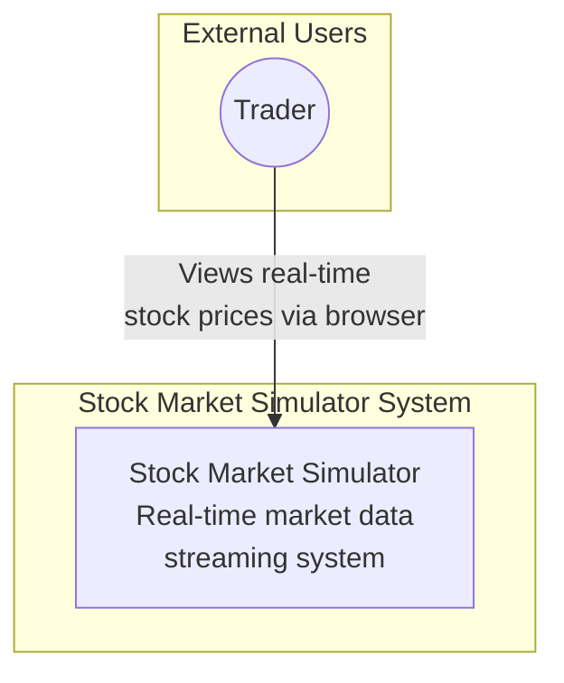
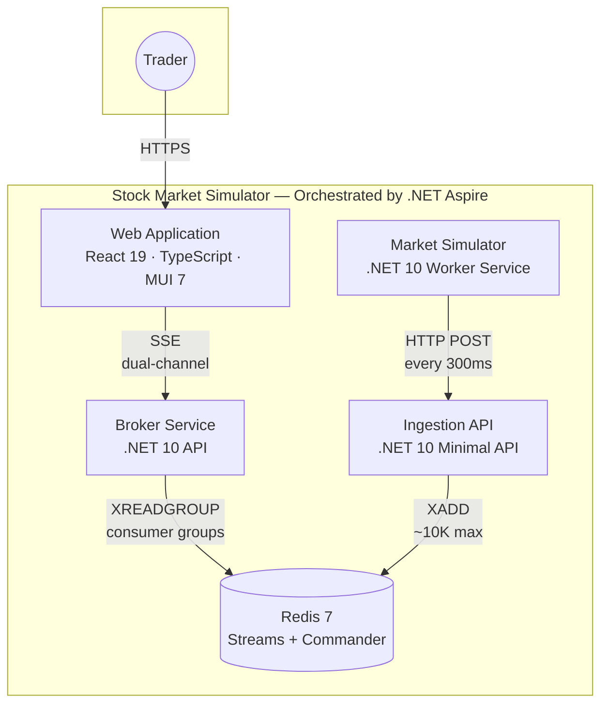
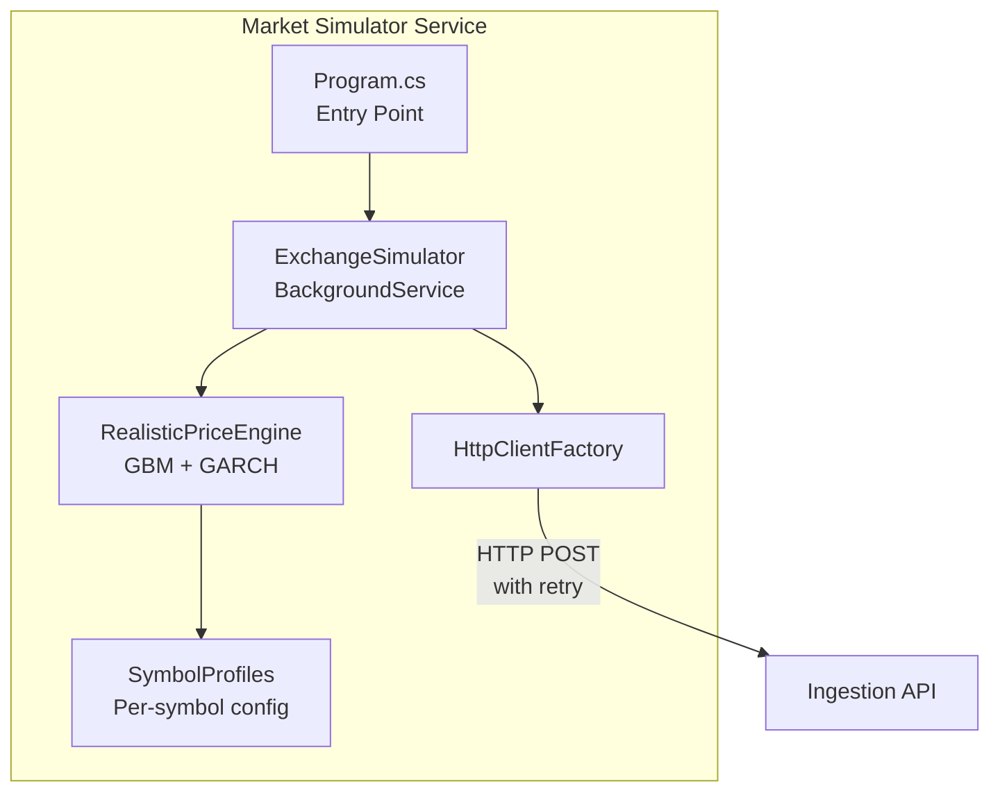
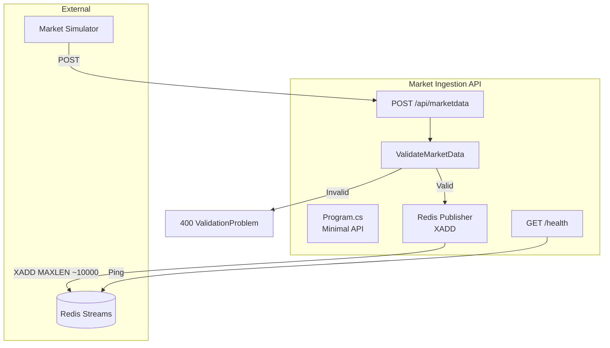
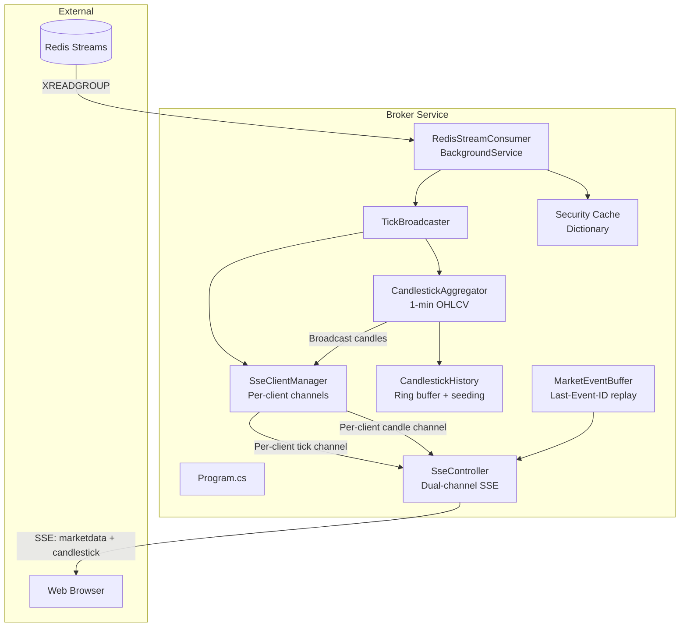
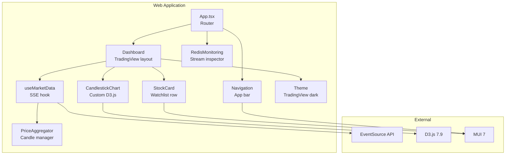
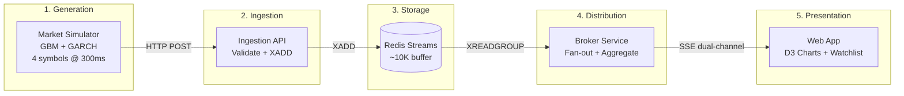
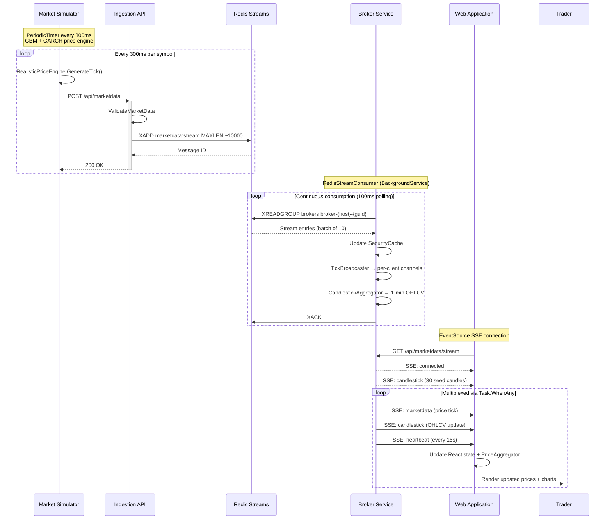
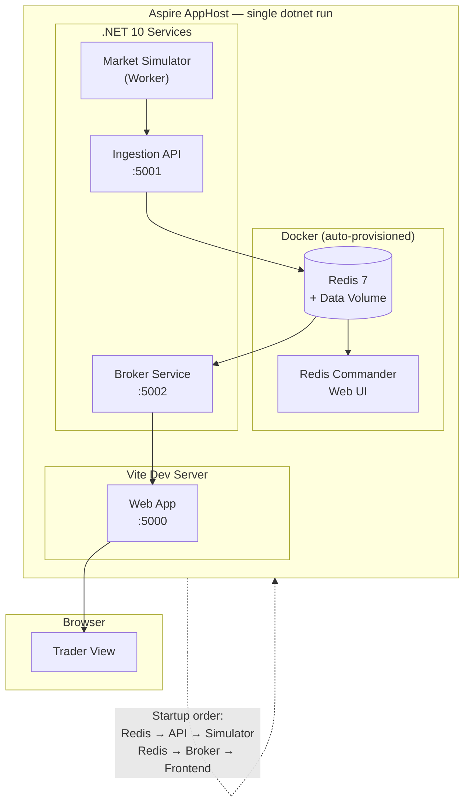
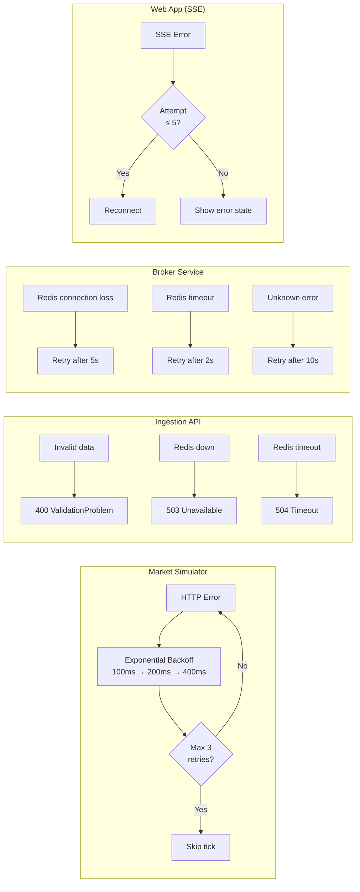

## What is Stock Market Simulator?

The Stock Market Simulator is a **real-time market data simulation system** built to explore modern streaming architectures. It generates statistically realistic synthetic market data and delivers it to web browser clients in real-time through a multi-stage event pipeline, creating a living laboratory for event-driven patterns.

Four Indian market symbols — **NIFTY50**, **BANKNIFTY**, **RELIANCE**, and **TCS** — are simulated with distinct volatility profiles, producing a continuous stream of price ticks that flow through Redis Streams and arrive in the browser via Server-Sent Events.

### Why Build This?

This system delivers value across three dimensions:

1. **Educational Tool**: Demonstrates event-driven patterns, message streaming, and real-time data delivery without connecting to actual market data providers
2. **Technical Demonstration**: Showcases modern .NET 10 capabilities — SSE with dual-channel multiplexing, Redis Streams consumer groups, bounded channels for backpressure, and realistic price generation using quantitative finance models
3. **Architecture Reference**: A complete implementation of a streaming pipeline documented with the C4 model, backed by formal Architecture Decision Records

---

## C4 Model Architecture

This system is documented using the **C4 model**, providing clear visualizations at multiple abstraction levels — from system context down to individual components.

### Level 1: System Context Diagram

Shows the Stock Market Simulator system and its relationship with users.

The Trader interacts with the Stock Market Simulator to view real-time stock price updates displayed in a TradingView-inspired interface with live candlestick charts and price tickers.

---

### Level 2: Container Diagram

Shows the high-level technology choices and how containers communicate. The entire system is orchestrated by **.NET Aspire**, which handles service discovery, health checks, and startup ordering.

**Container Responsibilities**:

| Container | Technology | Responsibility |
|-----------|-----------|---------------|
| Web Application | React 19, TypeScript 5.9, MUI 7, D3.js | TradingView-inspired UI with live charts |
| Broker Service | .NET 10, ASP.NET Core | Consumes from Redis, aggregates candles, streams via SSE |
| Market Ingestion API | .NET 10 Minimal API | Validates and publishes market data to Redis Streams |
| Market Simulator | .NET 10 Worker Service | Generates statistically realistic price ticks |
| Redis | Redis 7 with Streams | Message broker, event store, ~10K message buffer |

---

### Level 3: Component Diagrams

#### 3.1 Market Simulator Components

The simulator uses a sophisticated price engine combining multiple quantitative finance models.

| Component | Type | Responsibility |
|-----------|------|---------------|
| Program.cs | Entry Point | Configures DI and starts the worker host |
| ExchangeSimulator | BackgroundService | Orchestrates tick generation at 300ms intervals |
| RealisticPriceEngine | Service | Generates prices using GBM, mean reversion, and GARCH |
| SymbolProfiles | Configuration | Per-symbol volatility, base price, and mean reversion strength |
| HttpClientFactory | Factory | Manages HTTP connections with retry (3 attempts, exponential backoff) |

The **RealisticPriceEngine** is one of the more interesting components. Rather than simple random walks, it combines four mathematical models:

- **Geometric Brownian Motion (GBM)**: Log-normal price distributions via multiplicative random walk
- **Ornstein-Uhlenbeck Mean Reversion**: Pulls prices back toward a base price, preventing unrealistic drift
- **GARCH Volatility Clustering**: Conditional variance creates periods of high and low volatility — just like real markets
- **Micro-trends**: Random directional drift lasting 40–200 ticks to produce recognizable chart patterns

Normal random samples are generated via the Box-Muller transform. Volume correlates with price shocks — higher volatility produces higher trading volume.

---

#### 3.2 Market Ingestion API Components

| Component | Type | Responsibility |
|-----------|------|---------------|
| Program.cs | Minimal API | Defines routes, middleware, and error handling |
| POST /api/marketdata | Endpoint | Receives and processes market data ticks |
| GET /health | Endpoint | Redis connectivity health check |
| ValidateMarketData | Function | Validates symbol, price > 0, volume ≥ 0, timestamp within 5 minutes |
| Redis Publisher | Service | Publishes JSON-serialized events to `marketdata:stream` |

Validation rules enforce data integrity: no empty symbols, positive prices, non-negative volumes, and timestamps within a 5-minute future window. The stream uses approximate trimming at 10,000 messages to bound memory usage.

---

#### 3.3 Broker Service Components

The Broker Service is the most architecturally rich component, handling fan-out broadcasting, candlestick aggregation, and SSE multiplexing.

| Component | Type | Responsibility |
|-----------|------|---------------|
| RedisStreamConsumer | BackgroundService | Consumes from Redis using consumer groups with auto-ACK |
| TickBroadcaster | Service | Fans out ticks to all connected SSE clients via non-blocking `TryWrite` |
| SseClientManager | Service | Manages per-client bounded `Channel<T>` pairs (tick + candle) |
| CandlestickAggregator | BackgroundService | Builds 1-minute OHLCV candles, emits throttled updates every 500ms |
| CandlestickHistory | Service | Ring buffer (60 candles max) with 30 synthetic seed candles per symbol |
| MarketEventBuffer | Service | Stores last 1000 events with monotonic IDs for `Last-Event-ID` replay |
| SseController | ApiController | Multiplexes tick and candle channels into a single SSE stream |
| Security Cache | Dictionary | Tracks latest prices, computes change and change percentage |

**Key architectural pattern**: Each SSE client gets its own pair of bounded channels (tick capacity: 500, candle capacity: 500) with `DropOldest` backpressure. This solves the classic single-consumer-steals-message problem — every client independently receives every event.

The SSE stream multiplexes two event types using `Task.WhenAny`:
- `marketdata` events: Real-time price ticks
- `candlestick` events: Aggregated OHLCV candles (both in-progress and completed)

A heartbeat event fires every 15 seconds to keep connections alive through proxies and load balancers.

---

#### 3.4 Web Application Components

| Component | Type | Responsibility |
|-----------|------|---------------|
| App.tsx | React Router | Routes between Dashboard and Redis Monitoring |
| Dashboard | Page Component | TradingView-inspired layout: ticker strip, chart area, watchlist |
| useMarketData | Custom Hook | Manages SSE connection, parses events, maintains state |
| StockCard | Component | Compact watchlist row with price flash animations and mini sparklines |
| CandlestickChart | Component | 100% custom D3.js candlestick chart with crosshair and OHLCV tooltips |
| PriceAggregator | Utility Class | Manages rolling window of 60 candles from backend events |
| RedisMonitoring | Page Component | Displays Redis stream info, consumer groups, and message counts |
| Theme | MUI Theme | TradingView color palette: bullish `#26a69a`, bearish `#ef5350` |

The candlestick chart is built entirely with **D3.js** — no charting library. It renders SVG candle bodies, wicks, volume bars, grid lines, a current-price dashed line, and an interactive crosshair with OHLCV tooltip. The chart uses `ResizeObserver` for responsive sizing.

Price updates trigger CSS flash animations (green for up, red for down) on the watchlist cards, and each card includes an inline SVG mini-sparkline of the last 20 candles.

---

## Data Flow

  
  
End-to-end data flow: ticks travel from the price engine through Redis Streams to live browser charts

### End-to-End Pipeline

### Sequence Diagram: Complete Data Flow

---

## Deployment Architecture

### Development Environment with .NET Aspire

The entire system starts with a single command: `dotnet run` in the AppHost project. .NET Aspire handles service discovery, health-check-based startup ordering, and Redis provisioning via Docker.

Aspire enforces startup ordering via `WaitFor()`: Redis starts first, then the Ingestion API and Broker Service (which depend on Redis), then the Market Simulator (which depends on the Ingestion API), and finally the frontend (which depends on the Broker Service).

---

## Error Handling Strategy

Each layer implements targeted resilience patterns:

The Broker Service additionally supports **`Last-Event-ID` replay** — when a client reconnects, it sends the last event ID it received, and the broker replays missed events from an in-memory buffer of the last 1,000 messages. This provides at-least-once delivery semantics without requiring the client to handle gaps.

---

## The Flow

The system follows a clean, purposeful architecture:

#### 1. Data Generation
The **Market Exchange Simulator** generates synthetic tick data for NIFTY50, BANKNIFTY, RELIANCE, and TCS. Each tick includes:
- **Symbol** identifier
- **Price** (decimal, generated via GBM + GARCH models)
- **Volume** (correlated with price shocks — higher volatility means higher volume)
- **Timestamp**

Each symbol has a distinct profile — RELIANCE has the highest annualized volatility (20%), while NIFTY50 has the strongest mean reversion. This creates visually distinct chart patterns across symbols.

#### 2. Data Ingestion & Storage
Generated ticks flow through the **Ingestion API** into **Redis Streams**:
- **Validation**: Ensures data integrity — positive prices, valid symbols, reasonable timestamps
- **Streaming**: Appends to `marketdata:stream` with approximate trimming at 10,000 messages
- **Decoupling**: Separates data generation from consumption, providing ordering guarantees critical for financial data

#### 3. Distribution & Aggregation
The **Broker Service** does heavy lifting beyond simple relay:
- **Consumer Groups**: Uses Redis `XREADGROUP` for horizontally scalable consumption
- **Fan-out Broadcasting**: `TickBroadcaster` distributes to all connected clients via per-client bounded channels
- **Candlestick Aggregation**: Builds 1-minute OHLCV candles server-side for a single source of truth
- **Historical Seeding**: Generates 30 synthetic seed candles on first connection so charts aren't empty
- **SSE Multiplexing**: Combines tick and candle events into a single `text/event-stream` via `Task.WhenAny`

#### 4. User Display
The web interface provides a TradingView-inspired experience:
- **Ticker strip**: Scrolling price banner across the top
- **Candlestick charts**: Custom D3.js rendering with crosshair, OHLCV tooltips, and volume bars
- **Watchlist**: Compact cards with ₹ currency formatting, change % pills, and mini sparklines
- **Price flash animations**: Green/red CSS transitions on price updates
- **Redis monitoring**: Dedicated page showing stream health, consumer groups, and message counts

---

## Quality Attributes

### Performance
- Sub-100ms latency from generation to client display
- Bounded channels with `DropOldest` backpressure prevent slow clients from affecting others
- Efficient JSON serialization using `System.Text.Json` with `camelCase` naming

### Scalability
- Horizontally scalable broker instances using Redis consumer groups — each gets a unique consumer name (`broker-{hostname}-{guid}`)
- Per-client channel isolation enables independent backpressure per connection
- Stateless design enables load balancing across instances

### Reliability
- Automatic SSE reconnection with `Last-Event-ID` replay support
- Redis persistence ensures no data loss during restarts
- Health checks on all services (`/health` endpoints with Redis ping)
- .NET Aspire `WaitFor()` ensures correct startup ordering

### Observability
- **OpenTelemetry** distributed tracing across all .NET services via OTLP
- Redis Commander web UI for stream inspection
- Dedicated Redis monitoring page in the frontend
- Structured logging throughout

### Maintainability
- Clean separation via 5 independent services
- Shared contracts library with immutable records for events
- Dependency injection throughout
- 10 formal Architecture Decision Records documenting every significant choice

---

## Key Architectural Decisions

The project maintains **10 formal ADRs**. Here are the most significant:

### Why Redis Streams over Kafka or RabbitMQ?

Redis Streams provides exactly the capabilities needed without operational overhead:
- **Consumer groups** for horizontal scaling with `XREADGROUP`
- **Append-only log** with ordering guarantees
- **Built-in trimming** (`MAXLEN ~10000`) for bounded memory
- **Simple operational model** — already provisioned by Aspire
- Lower latency than Kafka for this scale of real-time delivery

### Why Server-Sent Events over WebSockets?

Communication is strictly server-to-client, making SSE the cleaner choice:
- **Automatic reconnection** built into the browser's `EventSource` API
- **`Last-Event-ID` replay** for at-least-once delivery on reconnect
- Standard HTTP infrastructure compatibility (proxies, CDNs, load balancers)
- Simpler protocol with no upgrade handshake or frame parsing

### Why Custom D3.js Charts over TradingView Lightweight Charts?

Full control without licensing constraints:
- No third-party library dependency or license restrictions
- Custom crosshair interaction with OHLCV tooltip
- Integrated volume bars and current-price line
- TradingView-consistent color scheme without the TradingView library

### Why Backend Candlestick Aggregation?

Single source of truth across all clients:
- All clients see identical candle boundaries and OHLCV values
- Reduces frontend computation — browser receives pre-aggregated data
- Throttled emission (every 500ms) prevents overwhelming slow clients
- Completed vs. in-progress candle distinction reduces flicker

### Why Bounded Channels with DropOldest?

Backpressure without blocking producers:
- Tick channels: capacity 500 per client
- Aggregator channel: capacity 2000
- `DropOldest` ensures the producer (Redis consumer) never blocks
- Slow clients lose old data gracefully rather than causing system-wide backpressure

---

## Technology Stack

| Layer | Technology | Version |
|-------|-----------|---------|
| Orchestration | .NET Aspire | 13.1 |
| Backend Runtime | .NET | 10.0 |
| Message Broker | Redis Streams | 7.x |
| Frontend Framework | React | 19.2 |
| UI Library | Material UI | 7.3 |
| Charting | D3.js | 7.9 |
| Build Tool | Vite | 7.2 |
| Language | TypeScript | 5.9 |
| Observability | OpenTelemetry | 1.14 |

---

## Future Enhancements

1. **Historical Data Replay**: Allow users to replay past trading sessions from Redis Stream history
2. **Technical Indicators**: Support MACD, RSI, Bollinger Bands overlaid on candlestick charts
3. **Multi-Timeframe Charts**: 1-minute, 5-minute, and hourly candle aggregation windows
4. **Order Book Simulation**: Add bid/ask spreads and market depth visualization
5. **Authentication & Multi-tenancy**: Per-user watchlists with cookie-based auth and connection-level targeting

---

## Conclusion

The Stock Market Simulator demonstrates how modern architecture principles create systems that are **reliable**, **scalable**, and **observable**. By applying enterprise patterns — consumer groups, bounded channels, event sourcing, fan-out broadcasting — to a focused problem domain, it builds clarity through constraints.

The interesting engineering isn't in any single component. It's in how they compose: a price engine that produces statistically realistic data, a streaming pipeline that never drops messages, a broadcast system that isolates client backpressure, and a frontend that renders it all at financial-grade fidelity.

> **"The quality of your work reflects the quality of your thinking. Build systems that think clearly."**

---

*Last Updated: February 7, 2026*  
*Architecture Version: 2.0*
