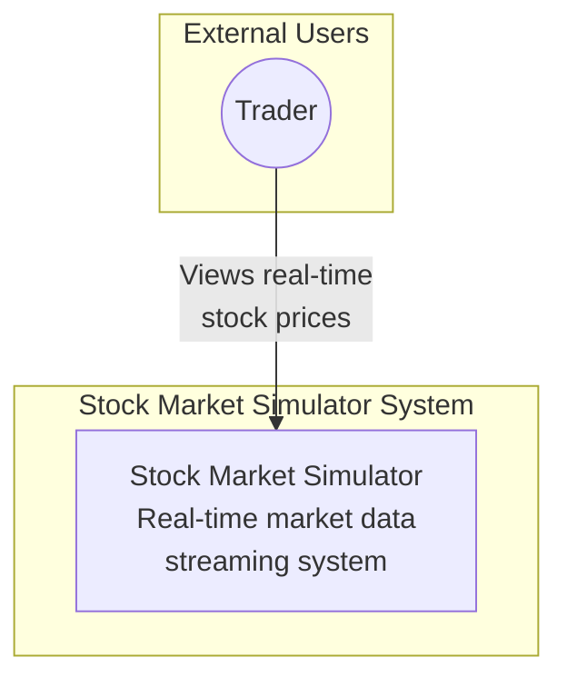
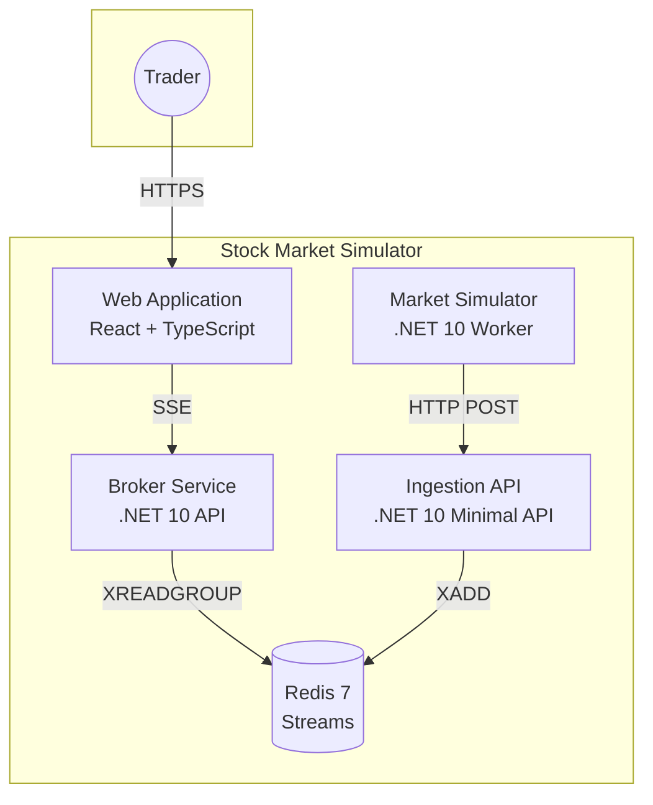
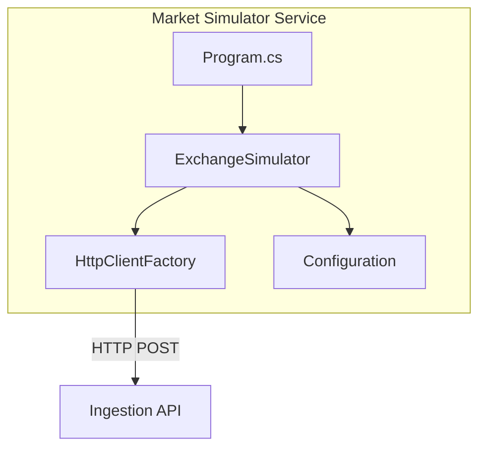
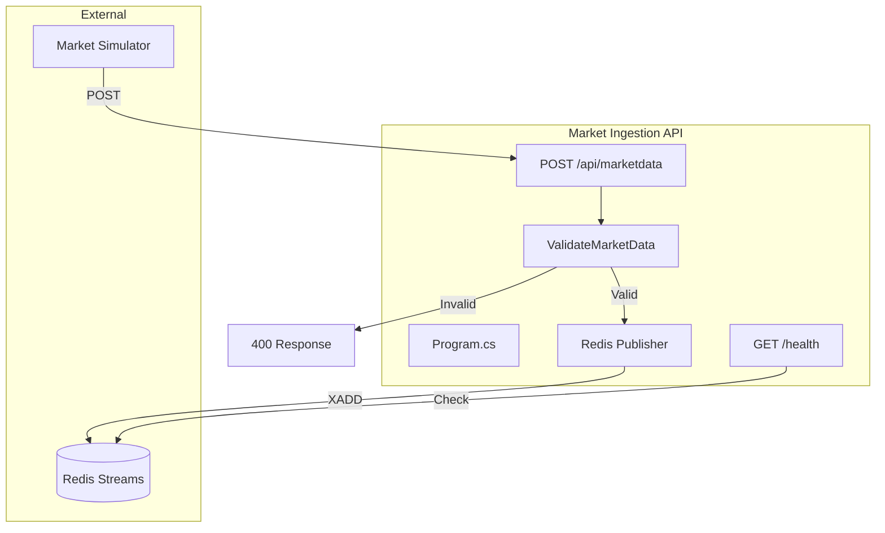
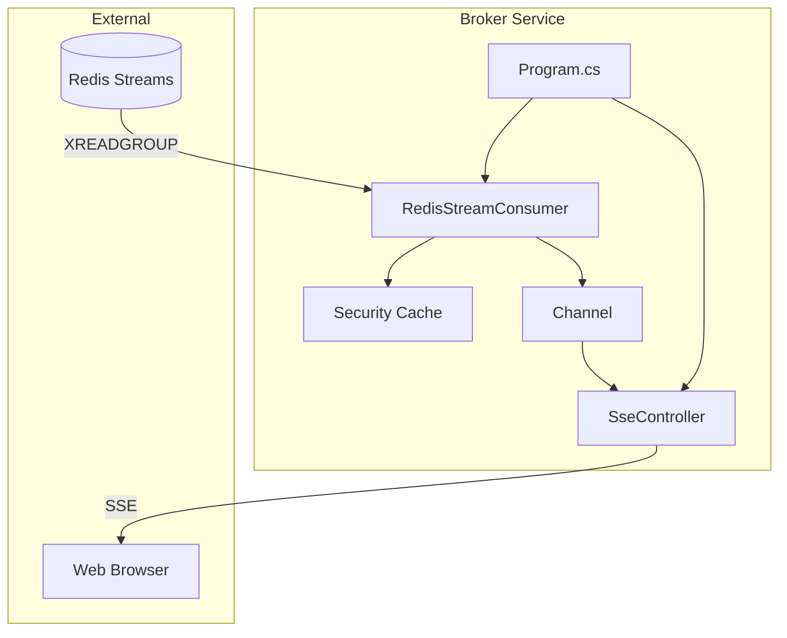
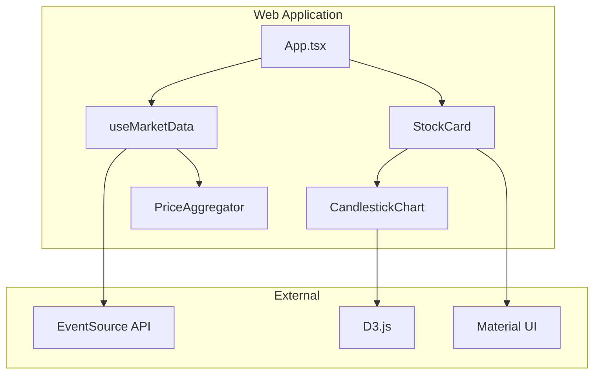
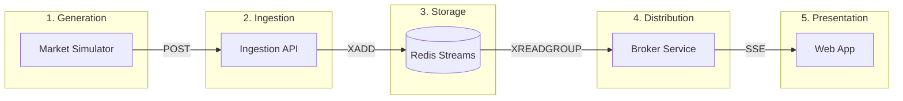
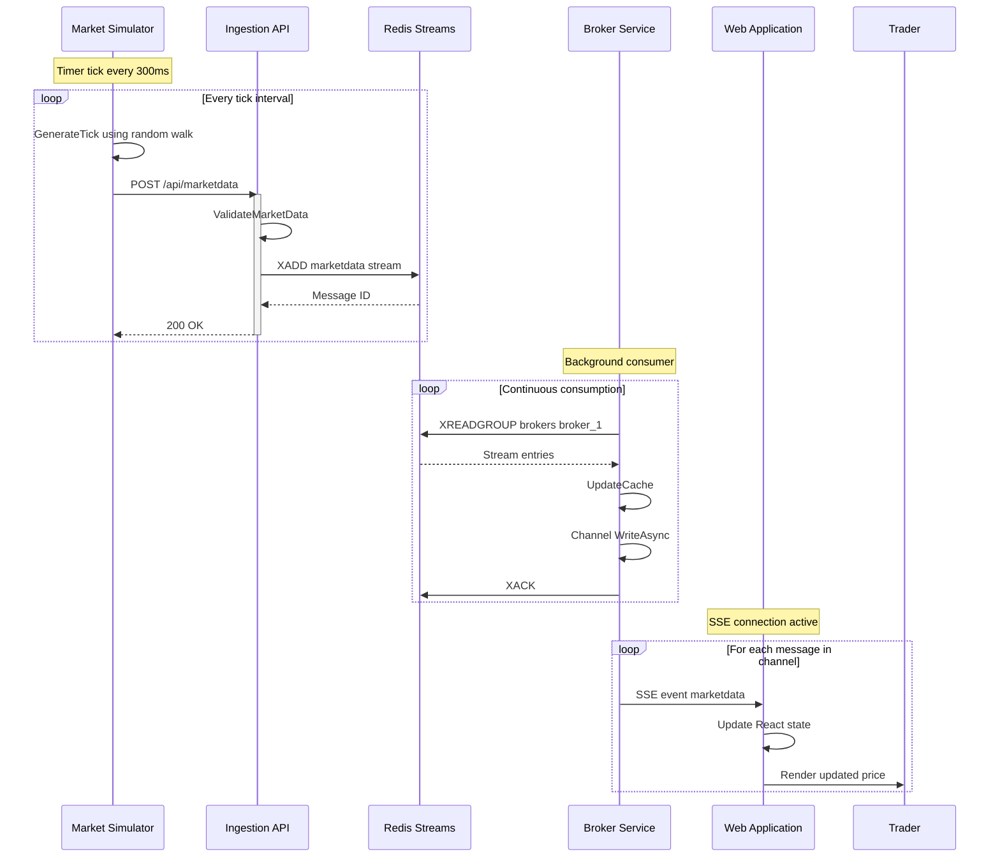
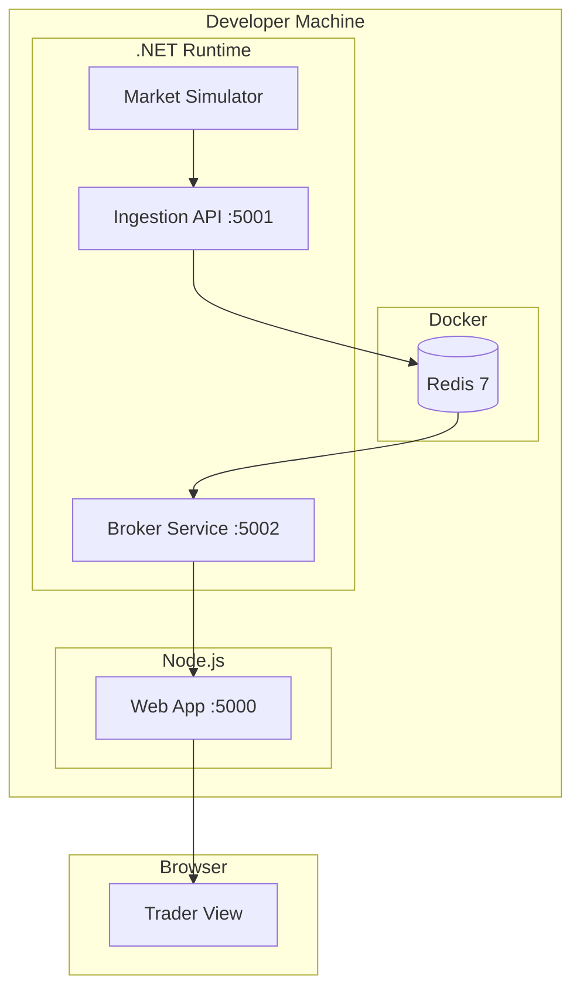
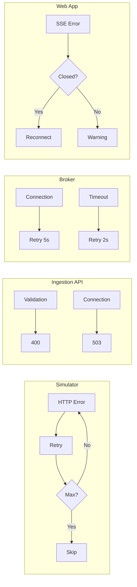

**Architecture · Streaming · .NET**  
_Work in Progress_

## What is Stock Market Simulator?

The Stock Market Simulator is a **real-time stock market data simulation system** that demonstrates modern streaming architectures in action. It generates synthetic market data and delivers it to web browser clients in real time, creating a living laboratory for event-driven patterns and high-throughput data pipelines.

### Business Value

This system delivers value across three dimensions:

1. **Educational Tool**: Demonstrates event-driven patterns, message queuing, and real-time data streaming without the complexity of connecting to actual market data providers
2. **Technical Demonstration**: Showcases modern .NET capabilities including SSE for real-time communication, Redis Streams for message persistence, and reactive programming patterns
3. **Architecture Reference**: Provides a complete implementation of a streaming pipeline that can be adapted for production scenarios requiring real-time data distribution

---

## C4 Model Architecture

This system is documented using the C4 model, providing clear visualizations at multiple abstraction levels.

### Level 1: System Context Diagram

Shows the Stock Market Simulator system and its relationship with users.

The Trader interacts with the Stock Market Simulator to view real-time stock price updates. This is a demonstration system that generates synthetic market data.

---

### Level 2: Container Diagram

Shows the high-level technology choices and how containers communicate.

**Container Descriptions**:

| Container | Technology | Responsibility |
|-----------|-----------|---------------|
| Web Application | React, TypeScript, Material UI | User interface for viewing prices |
| Broker Service | .NET 10, ASP.NET Core | Consumes from Redis, streams via SSE |
| Market Ingestion API | .NET 10 Minimal API | Validates and publishes market data |
| Market Simulator | .NET 10 Worker Service | Generates synthetic price ticks |
| Redis | Redis 7 with Streams | Message broker and event store |

---

### Level 3: Component Diagrams

#### 3.1 Market Simulator Components

| Component | Type | Responsibility |
|-----------|------|---------------|
| Program.cs | Entry Point | Configures DI and starts host |
| ExchangeSimulator | BackgroundService | Generates ticks using random walk |
| HttpClientFactory | Factory | Manages HTTP connections |
| Configuration | IConfiguration | Provides runtime settings |

---

#### 3.2 Market Ingestion API Components

| Component | Type | Responsibility |
|-----------|------|---------------|
| Program.cs | Minimal API | Defines routes and middleware |
| POST /api/marketdata | Endpoint | Receives and processes market data |
| GET /health | Endpoint | Reports service health |
| ValidateMarketData | Function | Validates input data |
| Redis Publisher | Service | Publishes to Redis Streams |

---

#### 3.3 Broker Service Components

| Component | Type | Responsibility |
|-----------|------|---------------|
| Program.cs | Entry Point | Configures services and middleware |
| RedisStreamConsumer | BackgroundService | Consumes messages from Redis |
| SseController | ApiController | Handles SSE client connections |
| Channel | Channel&lt;T&gt; | Broadcast buffer for SSE |
| Security Cache | Dictionary | Tracks latest prices |

---

#### 3.4 Web Application Components

| Component | Type | Responsibility |
|-----------|------|---------------|
| App.tsx | React Component | Main application layout |
| useMarketData | Custom Hook | Manages SSE connection and state |
| StockCard | React Component | Displays individual security |
| CandlestickChart | React Component | Renders D3 candlestick chart |
| PriceAggregator | Utility Class | Aggregates ticks into OHLC |

---

## Data Flow

### End-to-End Data Pipeline

### Sequence Diagram: Complete Data Flow

---

## Deployment Architecture

### Development Environment

---

## Error Handling Strategy

---

## The Flow

The system follows a clean, purposeful architecture:

#### 1. Data Generation
The **Market Exchange Simulator** generates synthetic tick data for symbols like NIFTY50 and BANKNIFTY. Each tick includes:
- Symbol identifier
- Current price
- Price change (delta)
- Trading volume
- Timestamp

This component simulates realistic market behavior with configurable volatility and tick frequency.

#### 2. Data Processing
Generated ticks flow into **Redis Streams** for:
- **Validation**: Ensuring data integrity and completeness
- **Queueing**: Providing backpressure management and reliable delivery
- **Persistence**: Maintaining a replay buffer for late-joining clients

Redis Streams acts as the backbone, decoupling data generation from consumption while providing ordering guarantees critical for financial data.

#### 3. Data Delivery
The **Broker Service** consumes from Redis Streams and pushes updates to connected web clients using Server-Sent Events (SSE). This approach provides:
- Automatic reconnection handling
- Efficient one-way communication (server to client)
- Native browser support without additional protocols

#### 4. User Display
The web interface renders live price cards showing:
- **Currency formatting**: Professional financial display
- **Delta coloring**: Visual indication of price direction (green for up, red for down)
- **Volume indicators**: Trading activity levels
- **Candlestick charts**: Historical price movement visualization

---

## Quality Attributes

### Performance Characteristics
- Sub-100ms latency from generation to client display
- Supports 10,000+ concurrent connections per instance
- Efficient serialization using System.Text.Json

### Scalability
- Horizontally scalable broker service using Redis consumer groups
- Stateless design enables load balancing across multiple instances
- Redis Streams provides ordering guarantees across distributed consumers

### Reliability
- Automatic client reconnection with exponential backoff
- Redis persistence ensures no data loss during system restarts
- Health checks monitor all critical paths

### Maintainability
- Clean separation of concerns across services
- Dependency injection throughout
- Comprehensive logging with structured events

---

## Architectural Decisions

### Why Redis Streams over RabbitMQ?
Redis Streams provides exactly the capabilities needed:
- Native support for pub/sub with persistence
- Consumer groups for horizontal scaling
- Simpler operational model
- Lower latency for real-time scenarios

### Why Server-Sent Events over WebSockets?
For this use case, communication is strictly server-to-client:
- Simpler protocol overhead
- Better browser support with automatic reconnection
- Standard HTTP infrastructure compatibility
- Sufficient for one-way real-time updates

### Why Minimal APIs over Controllers?
.NET Minimal APIs provide:
- Lower ceremony for simple endpoints
- Better performance with reduced allocations
- Native AOT compilation support
- Cleaner, more readable code

---

## Future Enhancements

1. **Historical Data Replay**: Allow users to replay past trading sessions
2. **Custom Indicators**: Support technical analysis indicators (MACD, RSI, Bollinger Bands)
3. **Multi-Timeframe Charts**: 1-minute, 5-minute, hourly views
4. **Order Book Simulation**: Add bid/ask spreads and depth visualization
5. **WebAssembly Client**: Leverage Blazor for richer client-side computation

---

## Conclusion

The Stock Market Simulator demonstrates how modern architecture principles create systems that are **reliable**, **scalable**, and **maintainable**. By applying enterprise patterns to a focused problem domain, we build clarity through constraints.

This isn't about showing every possible feature. It's about craftsmanship—choosing the right tools, applying proven patterns, and delivering value through disciplined engineering.

> **"The quality of your work reflects the quality of your thinking. Build systems that think clearly."**

---

*Last Updated: February 4, 2026*  
*Architecture Version: 2.0*
